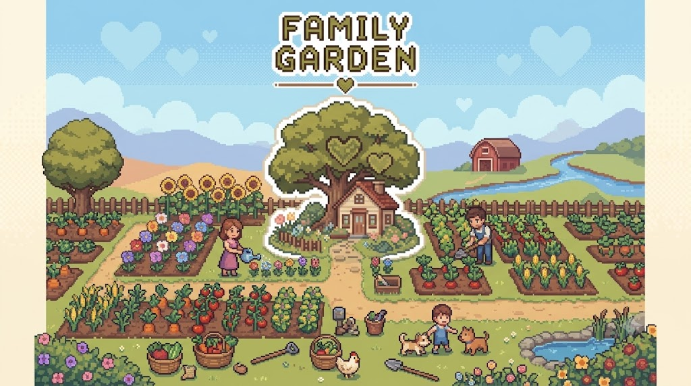
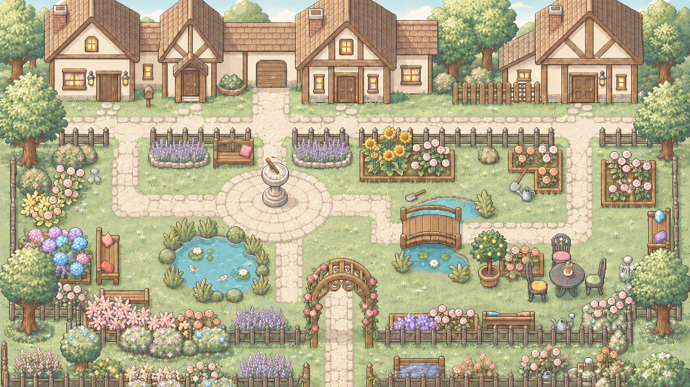

# Family Garden · 家庭花园

> 让家庭记忆长成一座可以共同生活、探索与回应的花园。



Family Garden 是一款面向家庭成员的 AI 像素生活游戏。玩家可以记录照片与故事，
在花园、共享农场、鱼塘和厨房中共同生活；AI 负责整理已有内容、生成温和的问题与料理，
但不会替家人编造关系或经历。

## 在线体验

**Web 版本：<https://family-garden-dev-s0rb3h9j.edgeone.cool/>**

- 推荐使用最新版 Chrome、Edge 或 Firefox；
- 进入页面后需要点击“进入家庭花园”，浏览器才会开放游戏音频；
- 核心单机玩法可直接体验；
- 真实 AI、成员身份、云同步和多人在线依赖腾讯云 CloudBase 服务与可用额度；
- EdgeOne 部署后的临时 `eo_token` 参数不属于项目域名，分享或提交作品时使用上面的固定域名。

## 我们想解决什么

很多家庭并不是联系不上，而是不知道怎样自然地开始交流。照片散落在相册和聊天记录里，
长辈的故事、共同旅行与普通日常也很难被持续补充。

Family Garden 不要求用户进行严肃的“家庭访谈”，而是把交流放进轻量玩法：

```text
记录一段记忆
  → AI 整理成可编辑的记忆卡片
  → 家人补充回答与共同细节
  → 花园长出记忆花和跨记忆藤蔓
  → 在农场、鱼塘、厨房与房间中继续产生新的互动
```

AI 在这里是“记忆整理助手”，不是故事作者。它只处理玩家主动提供的内容，不推断家庭关系，
不评价感情，也不把模型生成内容冒充成真实家庭事实。

## 当前可玩内容

| 模块 | 当前体验 |
|---|---|
| 三章主线 | 从重新打开花园，到共享农场，再到厨房与家庭餐桌 |
| 家庭花园 | 记录记忆、查看照片卡片、记忆花景观、DIY 花园布置 |
| 共享农场 | 选种、种植、浇水、成长、收获、畜牧围栏门互动 |
| 鱼塘 | 钓鱼、漂流瓶问题、记忆回答与水边探索 |
| 新厨房 | 可行走厨房场景、共享食材、互动烹饪、料理上桌 |
| 家庭地图 | 在花园、农场、鱼塘、厨房与房间之间旅行 |
| 角色系统 | 角色外观、昵称、家庭身份、在线成员显示 |
| 无障碍体验 | 关怀模式放大文字和 UI，不缩小游戏可见范围 |
| Web 版本 | 1280×720 逻辑画布、响应式显示、音频解锁启动页 |



## AI 与云端能力

### AI 工作流

- 图片或文字生成可编辑的记忆卡片；
- 基于已有记忆提出开放、低压力的家庭问题；
- 根据家庭共享仓中的食材生成料理；
- 分析房间照片中的可见物件与区域；
- 在两段已确认记忆之间提出可能的关联问题；
- 所有 AI 输出先经过 JSON Schema 校验，再进入游戏状态。

### 安全边界

- AI 不输出世界坐标；
- 房间分析只返回 `object_type + zone`；
- Godot 通过白名单目录生成场景，模型不能直接控制节点；
- 鉴权、非法输入和内容安全错误不会被 mock 伪装成真实成功；
- 网络或模型技术故障可以进入显式 fallback，并记录结果来源；
- 腾讯云密钥、AI API Key、service role key 和成员令牌不得提交到仓库。

### 云端身份

每台设备首次加入家庭时会通过 `data_gateway` 获取独立的 `member_token`。令牌只保存在该设备的
`user://cloud_identity.json` 中，用于解析 `family_id` 和 `member_id`。真实 AI 请求、家庭同步和
在线状态都依赖这一身份链路。

## 技术架构

```text
Godot 4.7 Web / Desktop
  ├─ SceneManager          场景、旅行与主流程
  ├─ MemoryManager         记忆与本地存档
  ├─ InventoryManager      背包、共享仓与料理材料
  ├─ AIClient              状态、校验、缓存、取消与 fallback
  ├─ AIWorkflowManager     AI 草稿、确认、落库与补偿
  ├─ CloudService          身份、家庭数据与同步
  └─ PresenceChannel       在线成员与场景事件
           │
           ├── CloudBase AI Gateway ── 内容安全 ── 腾讯混元 / TokenHub
           ├── CloudBase Data Gateway ── 家庭隔离数据与成员身份
           ├── CloudBase Storage ── 家庭照片与临时上传
           └── Presence Relay ── WebSocket 在线状态

Web 静态版本
  └── Tencent EdgeOne Makers / EdgeOne CDN
```

## 本地运行

### 环境

- Godot `4.7.stable`
- Compatibility 渲染器
- 推荐桌面分辨率不低于 1280×720

### 启动

1. 克隆仓库；
2. 使用 Godot 导入 `game/project.godot`；
3. 运行主场景；
4. 使用 WASD 或方向键移动，按 `E` 与场景物件互动。

```bash
git clone https://github.com/peilinpeng/family-garden-dev.git
cd family-garden-dev
open game/project.godot
```

公开的项目级 endpoint 位于 `game/config/`。个人成员令牌保存在 `user://`，不会进入源码仓库。
如果 CloudBase 未启用或额度不可用，核心本地玩法仍可运行，但真实 AI、身份和云端协作不可用。

## 本地测试

首次运行时安装三个 Node 工作区依赖，并在仓库根目录创建已忽略的 `.venv`：

```bash
./tools/test_all.sh --bootstrap
```

日常全量回归使用同一个入口：

```bash
./tools/test_all.sh
```

脚本会运行全部 Godot 测试场景、AI Gateway Node 测试、Gate 1 Python
JSON Schema 契约测试、Data Gateway 测试和 Presence Relay 测试。它只使用本地
mock，不调用真实 AI、CloudBase、Presence 线上服务或收费接口。

项目要求 Godot 4.7 和 Node.js 20.19+。macOS 会自动发现
`/Applications/Godot.app/Contents/MacOS/Godot`；其他环境可通过 `GODOT_BIN`
指定可执行文件。失败日志会保留在脚本输出的临时目录，设置
`KEEP_TEST_LOGS=1` 可同时保留成功日志。

真实云端冒烟测试会调用外部服务并可能产生费用，因此不包含在普通本地回归中。
M0 测试范围与基线结果见
[`docs/dev/60_m0_quality_baseline.md`](docs/dev/60_m0_quality_baseline.md)。

## Web 导出

```bash
/Applications/Godot.app/Contents/MacOS/Godot \
  --headless --path game \
  --export-release Web ../export_web/index.html
```

项目使用 `game/web/family_garden_web_shell.html` 作为自定义 Web Shell，负责：

- 用户点击后解除浏览器音频自动播放限制；
- 保持 1280×720 游戏画布的正确比例；
- 为 EdgeOne 的单文件限制重组分片 PCK/WASM。

`export_web/`、`.edgeone/` 与 `.tef_dist/` 都是构建产物，不进入源码仓库。

本地预览可使用：

```bash
npx vite export_web --host 127.0.0.1 --port 4173
```

## 仓库结构

```text
game/
  assets/        游戏美术、字体、音频与 TileSet
  config/        可提交的公开 endpoint 配置
  scenes/        Godot 场景
  scripts/       游戏系统、管理器和 UI
  tests/         Godot 回归测试
  web/           自定义 Web Shell

backend/
  ai/            AI Gateway、契约、内容安全与供应商适配
  cloudbase/     数据网关、在线中继与云端脚本
  mocks/         AI 功能的本地 mock

docs/
  dev/           协作、交接和验收记录
  submission/    比赛介绍、演示材料与截图
```

## 项目状态与边界

- 当前主开发分支仍采用 `feature/* → dev → main` 的协作模型；
- 新厨房 `KitchenNew.tscn` 已取代旧厨房场景；
- 语义房间生成仍保留独立的房间 TileSet，不依赖旧厨房场景；
- Web 图片选择需要浏览器文件权限；
- `user://` 数据受浏览器 IndexedDB、隐私模式与站点存储权限影响；
- CloudBase 云函数不可用时，Web 版无法取得成员身份或调用真实 AI；
- Web 音频需要玩家在启动页进行一次真实点击。

## 文档与协作

- 产品与演示：[`docs/README.md`](docs/README.md)
- 比赛提交材料：[`docs/submission/README.md`](docs/submission/README.md)
- AI 接口契约：[`docs/04_ai_interfaces.md`](docs/04_ai_interfaces.md)
- 后端数据模型：[`docs/05_backend_data_model.md`](docs/05_backend_data_model.md)
- 坐标与美术规范：[`docs/09_godot_coordinate_art_spec.md`](docs/09_godot_coordinate_art_spec.md)
- 贡献规范：[`CONTRIBUTING.md`](CONTRIBUTING.md)
- AI 协作规则：[`AGENTS.md`](AGENTS.md)

---

Family Garden 希望把“家庭沟通”从一次需要鼓起勇气的谈话，变成一座可以慢慢照料的花园。
