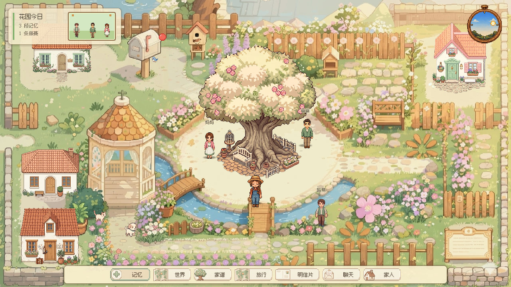
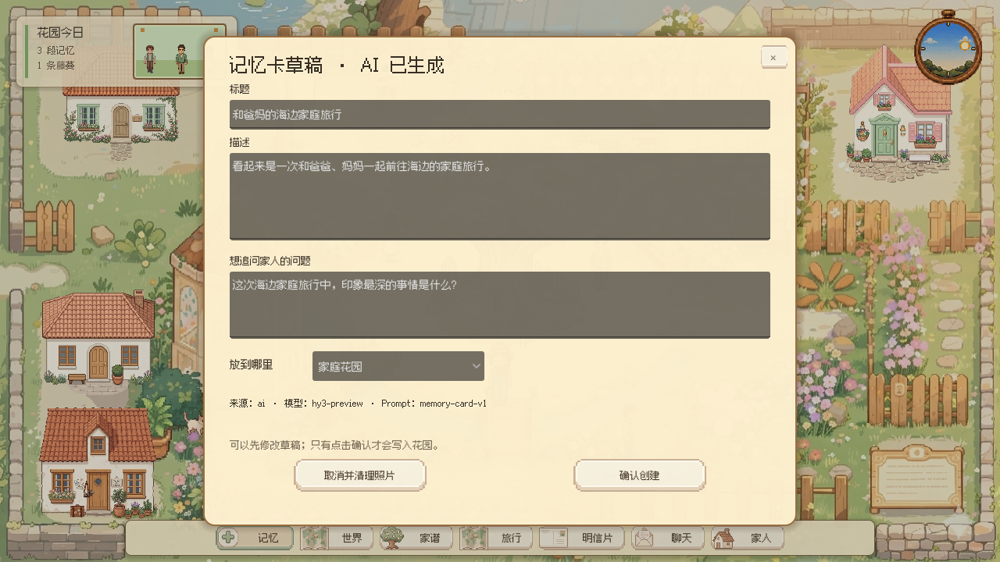
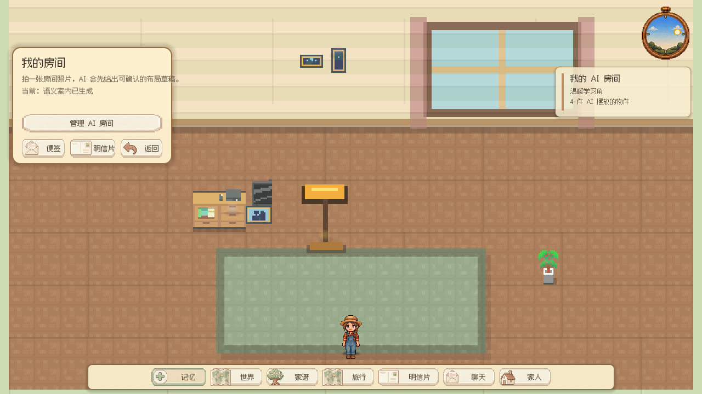

# Family Garden｜比赛交付包

本目录是最终提交和录制的唯一入口。执行顺序如下：

1. [`01_submission_checklist.md`](01_submission_checklist.md)：确认提交项、负责人和状态；
2. [`02_recording_shotlist.md`](02_recording_shotlist.md)：按镜头录制并检查素材；
3. [`03_screenshot_spec.md`](03_screenshot_spec.md)：拍摄、命名和筛选核心截图；
4. [`04_demo_assets_and_recovery.md`](04_demo_assets_and_recovery.md)：准备账号、图片、文字和故障兜底；
5. [`05_team_and_tech.md`](05_team_and_tech.md)：复制到比赛材料的团队分工与技术说明；
6. [`06_final_qa_report.md`](06_final_qa_report.md)：提交前查看最终验收结果和剩余人工项。

主演示内容以 [`../07_demo_script.md`](../07_demo_script.md) 为准。截图产物放在
`docs/submission/screenshots/`，源视频和包含隐私的原始照片不进入源码仓库。

## 交付原则

- 所有对外文案统一使用“AI 记忆整理助手”，不使用“AI 自动创造家庭故事”；
- 所有画面优先展示真实产品状态，不用概念图冒充已实现功能；
- 真实服务与 fallback 来源可区分，演示种子数据必须可说明；
- 视频、截图和项目介绍讲述同一条家庭故事，不各说各话；
- 提交前至少由一名未参与当天开发的人完整走一遍链接。

## 核心画面







## 重新生成截图

从 `game/` 目录运行以下命令。`FAMILY_GARDEN_TEST=1` 会隔离真实家庭与云端数据，
`FG_CAPTURE_SCREENSHOTS=1` 会停用循环动效并强制完整重绘，保证截图稳定且不带隐私：

```bash
FAMILY_GARDEN_TEST=1 FG_CAPTURE_SCREENSHOTS=1 \
FG_SCREENSHOT_DIR="../docs/submission/screenshots" \
godot --resolution 1280x720 tools/CaptureSubmissionScreenshots.tscn
```

竖屏提示单独使用 390×844 视口，并增加 `FG_CAPTURE_PORTRAIT_ONLY=1`。

记忆容量压力截图增加 `FG_CAPTURE_DENSE_GARDEN=1`。该模式会在隔离存档中依次生成
17、50、100 段记忆，输出 `10_memory_scale_17.png`、`11_memory_scale_50.png`、
`12_memory_scale_100.png` 与 `13_memory_archive.png`，用于确认长期可见景观始终不超过三个、
中央构图不膨胀且归档内每条记忆可达。工具还会输出 `14_memory_focus_card.png` 和
`15_memory_focus_vine.png`，并断言局部藤蔓可以显示和清空；这些测试图不进入正式提交图组。
